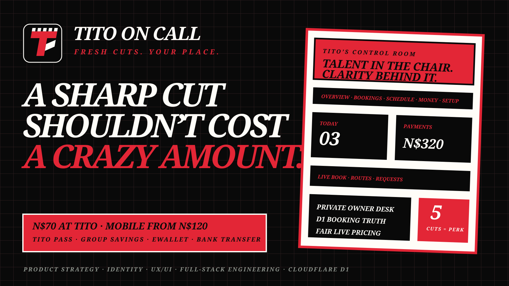

<p align="center">
  
</p>

<p align="center">
  
</p>

# Tito On Call — Fresh cuts. Your place.

**[Open the live experience](https://titos-barber.pages.dev/)**

Tito On Call is a full-stack booking and business-control platform for Paulus—known as Tito—a talented young Windhoek barber building a serious side hustle around student life. It gives clients a transparent way to book his chair or bring him to them, while giving Tito one private place to run the operation.

## The starting point

Tito already had the hard part: skill, ambition and clients willing to recommend him. What he did not have was an identity, a booking system or a clear way to price callouts without either losing transport money or charging the N$250-style prices that push a basic cut out of reach.

The brief became bigger than “make a barber logo.” It became a launch platform that could help one young barber turn talent into equipment, repeat clients and a credible business.

## What shipped

- A distinct **Tito On Call** identity with an electric-lime clipper-tooth `T` mark
- A customer booking journey for visits and mobile callouts
- A fixed N$70 base cut, with transparent N$50 / N$80 / N$110 travel additions
- Nearby, standard Windhoek and outer-Windhoek callout ranges
- eWallet and bank-transfer choices without pretending payment-provider automation exists
- Request notes for fades, designs, beard work, reference-photo follow-up and setup details
- Upfront travel-fee logic for callouts, protecting Tito from transport-cost no-shows
- A private PIN-protected owner desk for customer details and business controls
- Overview, bookings, schedule, money and setup workspaces
- Search, attention and callout filters; payment status; booking progression; cancellation history
- Live working-day and pricing controls backed by Cloudflare D1
- Reduced-motion support, mobile hardening and a cinematic editorial interaction system

## Fair callout economics

| Booking | Customer total | What changes |
|---|---:|---|
| Visit Tito | N$70 | The base cut only |
| Nearby callout | N$120 | N$70 cut + N$50 travel |
| Standard Windhoek | N$150 | N$70 cut + N$80 travel |
| Outer Windhoek | N$180 | N$70 cut + N$110 travel |

The haircut does not become artificially expensive because it is mobile. Distance adds the travel fee. The fee is shown before booking and paid before Tito moves; the cut balance is paid after the service.

## Tito’s control room

The backend is deliberately more than a table of names:

- **Overview** — today’s rhythm, active value and items needing attention
- **Bookings** — customer search, cut notes, route details, payment and job status controls
- **Schedule** — a study-aware working week and the day’s movement timeline
- **Money** — booked value, recorded receipts, callout travel fees and outstanding balances
- **Setup** — live base-cut and route prices, plus availability publishing

Customer numbers, addresses, money status and controls are never returned by the public state API. Tito’s owner API requires a deployment secret that is not stored in the public or private repository.

## Product decisions

### One barber before a marketplace

The platform begins with Tito’s personal reputation. A multi-barber marketplace before the first barber has demand would dilute the story, complicate trust and turn a human launch into a generic directory. The architecture can later expand into a vetted barber network once Tito’s own operating model is proven.

### No invented business details

The exact chair location, mobile number and payment destination were not supplied. The interface therefore says Tito will confirm them directly instead of publishing placeholders as if they were real.

### Motion with purpose

Black, warm white, electric lime and orange create a streetwear/editorial identity with hard borders, offset shadows and short reveal/float/pulse motion. The system stays readable without animation and respects `prefers-reduced-motion`.

## Architecture

```text
Customer booking UI
        │
        ├── public settings API ── pricing + open days
        ├── booking API ────────── slot and workday validation
        │                               │
        │                               ▼
        │                         Cloudflare D1
        │                               ▲
        └── PIN-protected owner API ────┤
                                        └── bookings · payments · events · availability
```

The production implementation uses Vinext/React, TypeScript, accessible UI primitives, Cloudflare edge execution, D1 and Drizzle-managed SQL migrations. Production source, credentials, customer data and deployment configuration remain private.

## Privacy and operational boundary

- This repository is documentation only; application source is private.
- No customer record, owner PIN, payment destination or exact visit location is published here.
- eWallet and bank transfer remain human-confirmed workflows until Tito chooses approved provider integrations.
- Reference photos are shared directly after booking instead of being stored by the prototype.
- The public launch should not claim equipment, vehicle access or business details Tito has not confirmed.

## Future path

Once Tito’s own booking rhythm is proven, the same model can become a trusted barber hub: verified profiles, availability, service menus, location-aware job matching, shared equipment or transport pools, barber dashboards and a platform-level trust and dispute layer. Tito remains the founding proof, not an anonymous listing.

## Role

Product strategy · brand direction · identity design · pricing model · service design · UX/UI · interaction and motion design · full-stack engineering · data modelling · access-control boundary · Cloudflare deployment

---

A Digital Experience by **[Freeman Ipumbu](https://freeman-ipumbu.pages.dev/)** for a young Namibian barber whose talent deserves a bigger stage.
